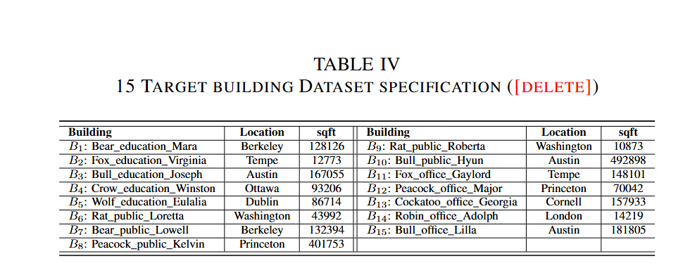

# DecAug Synthetic Load Dataset

This repository provides the synthetic load dataset generated using the **DecAug** framework, as described in our paper:

> **"Enhancing Observability for Cold-Start Buildings: A Decomposition-Based Demand Synthesis Approach"**
> \[Under review at IEEE Transactions on Smart Grid]

## 📘 Overview

The **DecAug Dataset** aims to support research in energy consumption forecasting and synthetic data generation. It simulates realistic electricity load profiles based on the learned consumption patterns.

We also plan to release the full source code upon the acceptance of the associated paper.

## 🧩 Dataset Description

The dataset contains electricity load data generated for 150 buildings (50 buildings each for **education**, **office**, and **public** category) with distinct seasons and data lengths. The dataset is generated using a decomposition-based data generation approach trained on a public dataset of more than 1000 real-world building data collected for two years.

We plan to release the complete generated synthetic dataset upon the acceptance of the associated paper.

## 📂 Data Source

The original real-world load data used to train the DecAug model is the **the Building Data Genome Project 2**, which contains electricity consumption data for 1636 buildings in 19 different locations from around the world. The Genome dataset is publicly available and can be accessed at the following link:

🔗 [https://github.com/buds-lab/building-data-genome-project-2](https://github.com/buds-lab/building-data-genome-project-2)


## 🧪 Generation Method

The data is produced using **decomposition-based** augmentation framework, which first decomposes load time series data into three dominant components: the daily pattern, the seasonal context, and the irregular fluctuation and then separately augments each component through (i) time-series decomposition, (ii) component-specific generation (including pattern mixing, domain translation, and kernel density modeling), and (iii) contrastive-learning-based recombination guided by an evolutionary graph of pattern transitions.

Detailed methodology is available in Section III of our paper.


## 📁 Files

CSV files under the directory `generated_data/` correspond to tabular data, which contains the generated hourly-sampled data for buildings in different seasons across diverse data length.


## 📊 Format Example

For instance, `generated_data/spring_15days.csv` refers to the generated 15-day spring data with a one-hour interval. The first few rows and columns in this csv file is shown below.

|  | Fox_education_Virginia | Fox_education_Lily | Fox_education_Kris |
| :-----: | :----: | :----: | :----: |
| 1 | 4.12 | 160.94 | 37.61 |
| 2 | 5.00 | 161.81 | 39.09 |
| 3 | 3.75 | 158.66 | 43.54 |
| 4 | 3.54 | 167.62 | 36.30 |
| 5 | 22.34 | 161.50 | 34.34 |

The CSV files in `generated_data/` contain tabular data for four seasons (i.e., spring, summer, autumn, winter) and three data lengths (i.e., 15 days, 30 days, 90 days).


## 🛠️ How to Use the Dataset

This dataset is designed to support downstream tasks such as residential load forecasting.
Below is a guide on suggested data processing:
- Normalize load values if needed
- Apply sliding windows if you wish to create multiple overlapping samples per building

## Appendix Materials

1. Specifications for buildings selected in the experiment.
   <p align="center">
      
   </p>
2. A real case study of two weeks of synthetic data generated for Building B2 in the paper, which typically exhibits higher energy consumption in winter and lower consumption in summer, accompanied by several irregular fluctuations. The results demonstrate that DecAug can generate realistic and diverse load patterns even when trained on a very limited dataset of only two weeks.
   <p align="center">
      
   </p>

## 📜 License

This dataset is released under the **CC BY-NC 4.0** License. You are free to use, adapt, and share it for non-commercial research purposes, provided that you cite the original paper.


## 📝 Citation

If you use this dataset in your research, please cite:
```bibtex
@article{DecAug2026,
  title={Enhancing Observability for Cold-Start Buildings: A Decomposition-Based Demand Synthesis Approach},
  author={Yang Deng and others},
  journal={IEEE Transactions on Smart Grid},
  year={2026},
  note={Under review}
}
```


## 📬 Contact

For questions or collaborations, please contact:

Yang Deng

The Hong Kong Polytechnic University

Email: marco.deng@polyu.edu.hk
